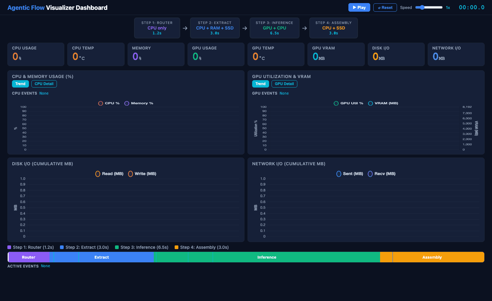

# Agentic Flow Visualizer

A markdown-driven visualization tool for explaining agentic AI pipeline behavior.

This project is a **scenario player/visualizer** (not a physics-accurate simulator). You manually define stages, events, and hardware behavior in a markdown file, then generate:

- `metrics_output.json` (time-series data)
- `pipeline_dashboard.html` (interactive playback dashboard)

## Quick Preview

A short preview of the full dashboard playback:



## What It Shows

- Pipeline stages and transitions over time
- Global clock and elapsed playback time
- CPU, GPU, memory, disk, and network trends
- CPU multicore/caches and multi-GPU details
- Event overlays with IDs/names, including parallel events
- Resource-relevant event strips in CPU/GPU panels

## Repo Files

- `pipeline_demo.py`: parser + data generator + dashboard data injector
- `pipeline_config.md`: input scenario definition
- `metrics_output.json`: generated metrics output
- `pipeline_dashboard.html`: generated visual dashboard

## Quick Start

Prerequisite: Python 3

Run from repo root:

```bash
PYTHONDONTWRITEBYTECODE=1 python3 pipeline_demo.py \
  --config pipeline_config.md \
  --metrics-out metrics_output.json \
  --dashboard pipeline_dashboard.html
```

Then open `pipeline_dashboard.html` in a browser.

## Configuration Model

`pipeline_config.md` has three sections:

- `## Global`: sample interval, clock start, hardware counts
- `## Stages`: pipeline phase timeline and baseline resource behavior
- `## Events`: overlays that can run serially or in parallel

You can define stages/events in c-struct-like rows:

```md
{ id: inference, name: Inference, start: 4.0, end: 10.5, cpu: on, gpu: gradual_increase }
```

## Stage/Event Timing

Each stage/event supports any of:

- `start` + `end`
- `start` + `duration`
- `end` + `duration`

Events are active by time overlap and appear in `active_event_ids`.

## Resource Behavior Fields

Supported behavior values:

- `off`
- `on`
- `gradual_increase`
- `gradual_decrease`

Per-resource intensity:

- `cpu_level`, `gpu_level`, `mem_level`, `disk_level`, `network_level`
- Range: `0.0` to `1.0`

## CPU/GPU Targeting in Event Rows

Use `resource_target` to declare event intent directly in each event row:

- `cpu`
- `gpu`
- `cpu_gpu`
- `none`
- `auto` (default)

Example:

```md
{ event_id: E100, name: CPU Burst, start: 2.0, duration: 1.0, resource_target: cpu, cpu: on }
{ event_id: E101, name: GPU Warmup, start: 4.0, duration: 1.2, resource_target: gpu, gpu: gradual_increase }
{ event_id: E102, name: Joint Compute, start: 5.0, duration: 2.0, resource_target: cpu_gpu, cpu: on, gpu: on }
```

If `cpu` or `gpu` is explicitly set in the row, that explicit value overrides the `resource_target` default.

## Uniform vs Custom CPU/GPU Load

For stages and events:

- `cpu_load_mode: uniform|custom`
- `gpu_load_mode: uniform|custom`

Custom distributions:

- `cpu_core_loads: <comma-separated list>`
- `gpu_device_loads: <comma-separated list>`

Rules:

- In `custom` mode, you must provide values for **all declared** cores/devices.
- Values are normalized into weights automatically.

## Presentation Workflow

1. Edit `pipeline_config.md` for your scenario.
2. Regenerate JSON + dashboard with `pipeline_demo.py`.
3. Open `pipeline_dashboard.html` and play the flow.
4. Use stage timeline, event strips, and CPU/GPU detail toggles for explanation.

## Notes

- This tool is designed for explainability and visualization.
- Output values are synthetic but deterministic enough for storytelling (seeded/noise-smoothed generation).
